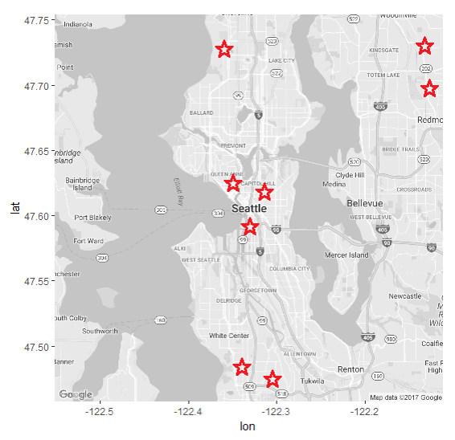
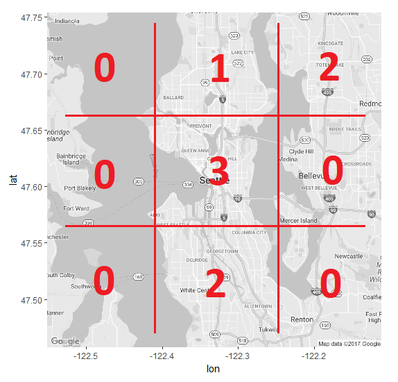
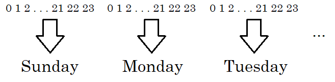

```{r setup, include=FALSE}
knitr::opts_chunk$set(echo = FALSE)
```


## Motivations

This project began as a submission for This Is Statistics' Police Data Challenge, a competition intended for high school and undergraduate teams.

The goal is to make statistically-backed recommendations to law enforcement that might lead to improvements in public safety. The challenge specifies analyzing the 911 dispatch data of Baltimore, Cincinatti, and/or Seattle.

## Data set

We chose to look at the Seattle police dispatch data set. Overall, it was the most neatly formatted and uniform data set. 

```{r}
head(seattle, 1)
```

## Goal

- Show locations on a map that are most likely to be subject to burglary/theft. 
- Across any date and time during the week. 

- Would allow law enforcement to increase patrols in these areas to deter theft, or to catch thefts sooner.

## Data set

Filtered for thefts/burglaries
```{r echo = FALSE}
theft_groups <- c("ROBBERY", "BURGLARY", "AUTO THEFTS", "SHOPLIFTING")
theft_sub_groups <- c("RESIDENTIAL BURGLARIES", "THEFT", "ROBBERY", "AUTO THEFTS")
theft_descriptions <- c("THEFT - MISCELLANEOUS", "SHOPLIFT", "BURGLARY - RESIDENTIAL, OCCUPIED", "THEFT - CAR PROWL",
                        "BURGLARY - RESIDENTIAL, UNOCCUPIED", "STRONG ARM ROBBERY", "BURGLARY - COMMERCIAL", "AUTO THEFT",
                        "THEFT - AUTO ACCESSORIES", "ARMED ROBBERY", "BURGLARY - UNOCCUPIED STRUCTURE ON RESIDENTIAL PROPERTY")
```
```{r echo = TRUE}
thefts <- seattle %>% filter(Event.Clearance.Group %in% theft_groups |
                  Event.Clearance.SubGroup %in% theft_sub_groups |
                  Event.Clearance.Description %in% theft_descriptions)
```
Used the lubridate library to standardize days and time format
```{r echo = FALSE}
thefts$Date <- substr(thefts$Event.Clearance.Date, 1, 10)
thefts$Time <- substr(thefts$Event.Clearance.Date, 12, 22)
```
```{r echo = TRUE}
thefts$Date <- mdy(thefts$Date)
thefts$Weekday <- wday(thefts$Date)
thefts$Time <- format(strptime(thefts$Time, "%I:%M:%S %p"), 
                      format = "%H:%M:%S")
thefts$Hour <- as.numeric(substr(thefts$Time, 1, 2))
```
```{r echo = FALSE}
drop_columns <- c("Event.Clearance.Date", "Event.Clearance.Group", "Event.Clearance.SubGroup", "Event.Clearance.Description",
                  "Initial.Type.Description", "Initial.Type.Subgroup", "Initial.Type.Group", "At.Scene.Time")
thefts <- thefts[, !(names(thefts) %in% drop_columns)]
```

## Filtered Data set
Kept only the latitude, longitude, day, and time variables.
```{r}
head(thefts, 10)
```

## Grid

The ultimate goal was to predict where thefts would be observed, and at what rate, using a machine learning model. However, in order to predict where they will occur, we also need to know where they don't occur.

To this end, we need to transform our data, a list of incidents, into a set that describes each possible location. To do this, we utilize a grid that details the number of incidents within each grid space.

## Grid


## Grid


## Time

We want to use time as a regressor in our model: for example, thefts are more common at 2 AM than 9 AM. We could use every minute, even second, during a month, or even a year. But this is incredibly computationally intensive and also fairly noisy data as we consider smaller time periods. As a compromise, we elected to make predictions based on the hour of the day and the day of the week.

</center>

## Sorting

Our initial model was trained using a 10x10 grid overlayed over Seattle. When accounting for time per the "buckets" outlined earlier, this gives 16,800 data points. 

For this relatively small grid, it took approximately 4 1/2 hours to transform the data.

## Sorting


## Machine Learning

To make the predictions, we created a random forest model using the *cforest* method in the *caret* package. The predictors used were the location of the incident adjusted to the grid, as well as the time "bucket" in which the incident occurred.

The data was split into training and test sets using an 80% - 20% split. This was distributed evenly across time, to ensure that a full view of the city was given for a given time. For this reason, the data was not split spatially.

```{r eval = FALSE, echo = TRUE}
trees <- train(num_thefts ~ .,
               data = theft_train,
               method = "cforest",
               trControl = cross_validation,
               tuneGrid = tuning_grid)
```

## Model Summary
```{r}
trees
```

## New Grid Generation

Using the model trained earlier, we can input a location and time to obtain an estimate for the relative incident density in the area.

The be able to see more details within the city, we generated a new grid to input into our model. This new grid had dimensions 20x20, for a total of 67,200 elements. A dataframe is constructed containing all of these locations for all hours of the week. 

```{r}
head(twenty_grid_orig[,-6], 6)
```

## Predictions

This new grid was fed into the model to obtain theft density predictions.
```{r}
head(twenty_grid_orig, 10)
```

## Transformation for Plotting

Using the *ggmap* and *ggplot2* packages, heatmaps of these predictions were created to view the general density of predicted thefts.

However, the data needed to be transformed again as the heatmap only considered event locations rather than density of events. Therefore we transform the frequency of incidents in a grid spot into a finite number of observations occuring at some spot representative of that grid element. 

```{r}
head(twenty_grid)
```

## Dynamic Visualization

To visualize the predictions, heatmaps of predicted theft density were created for every time "bucket", resulting in 168 plots. These were stitched together into a dynamic graphic using the *imagemagick* tool.

## Results

- Visualization show approximations, also allows visualization of general grid size/shape.
- Model follows geographical features fairly well, follows north-south to an extent. Center band across bodies of water due to population densities along that latitude. 
- This may be remedied with a finer grid.
- Not entirely sure about method used to split data into training and test sets.
- Low r-squared values, indicating that perhaps there are many more factors to predicting theft than time and space.

## Future Work

- Interested to compare how initial and post grid sizing affects results. This just takes time due to computing resources. 
- Research into other methods of dealing with spatial and time series prediction.
- Refactoring grid system to account for geographical features like water.

Code and related data can be found at: https://www.github.com/ishansaraf/PoliceDataChallenge2017